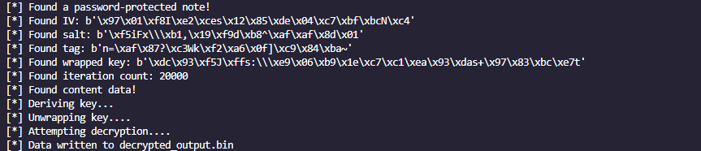

# Secure-Notes-Decryptor
Python POC to decrypt IOS secure notes given the NoteStore.sqlite path.

## Why ?

This is only a proof of concept working in my specific case and may not work in other cases. I recommend using [apple_cloud_notes_parser](https://github.com/threeplanetssoftware/apple_cloud_notes_parser/tree/master) if possible. I wrote this script because it wasn't working in my case.

## How to use ?

    python .\decryptor.py --password 'My_P4ssW0Rd' --path ./NoteStore.sqlite

## Credits

Credits go to this fantastic blog post about the IOS notes DB structure 
https://ciofecaforensics.com/2020/07/31/apple-notes-revisited-encrypted-notes/